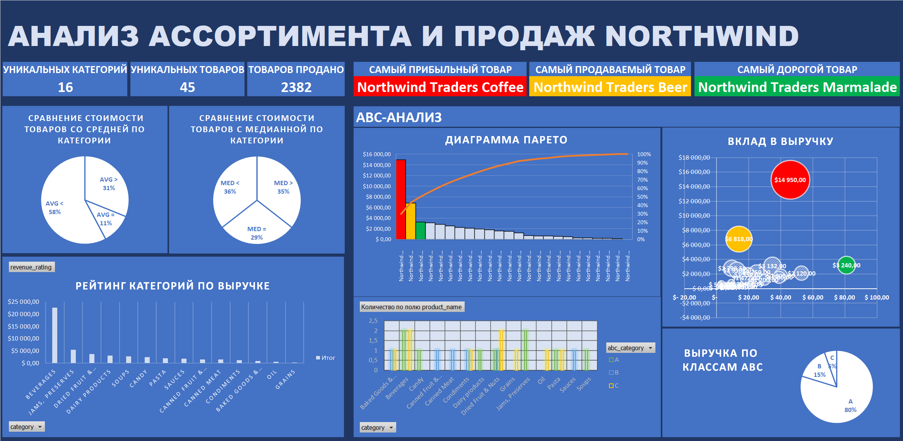

# Product Assortment & Sales Analysis - Northwind Dataset
Анализ товарного ассортимента и продаж Northwind при помощи MS Excel

> Проект выполнен в рамках практики и демонстрации навыков в аналитике больших данных и применении аналитических инструментов.
> Скорее всего, вы нашли его, перейдя по ссылке в моем [резюме](https://volgograd.hh.ru/resume/b9758e61ff101768eb0039ed1f437061786156) или сопроводительном письме.
>
> ### Мои другие проекты:
> 
> Python:
> [Uplift Modeling, T-Learner - Criteo Uplift Modeling dataset](https://github.com/Didiplant/Uplift-Modeling-T-Learner---Criteo-Uplift-Modeling-dataset)
> 
> MySQL:
> [Product Assortment & Sales Queries - Northwind dataset](https://github.com/Didiplant/Product-Assortment-Sales-Queries---Northwind-dataset)

Ниже приведены результаты анализа товарного ассортимента и продаж Northwind. Данная работа является логическим продолжением [этого](https://github.com/Didiplant/Product-Assortment-Sales-Queries---Northwind-dataset) проекта.

### **Используемые данные:**

Датасет **Northwind** (лицензия: Microsoft Public License (Ms-PL)), создан Microsoft как пример для обучения работе с реляционными базами данных.

Включает 20 таблиц с информацией о клиентах, заказах, товарах, сотрудниках и поставщиках вымышленной фирмы «Northwind Traders», которая продает еду по всему миру.

В данной работе используются [результаты](tables) аналитических запросов к базе Northwind. Подробное описание того, как они были получены, можно найти [здесь](https://github.com/Didiplant/Product-Assortment-Sales-Queries---Northwind-dataset).

### **Инструменты и навыки:**
MS Excel: power query, сводные таблицы, сводные диаграммы, ВПР, ИНДЕКС + ПОИСКПОЗ, СУММЕСЛИ, построение дашборда (KPI, круговая диаграмма, диаграмма Парето, пузырьковая диаграмма, столбчатая диаграмма), составление отчета.

### **Структура проекта:**

    Product-Assortment-Sales-Analysis---Northwind-dataset/
    ├── tables/    # Данные, использованные для анализа
    ├── README.md
    ├── dashboard.png       # Итоговый дашборд в png формате
    └── report.sql    # Отчет, включающий преобразованные и дополненные исходные данные, интерактивный дашборд и анализ результатов
	

### **Результаты:**

1. **Beverages - лидер среди категорий.** Она существенно превосходит остальные по объему выручки и является ключевой для бизнеса.
2. **ABC-анализ демонстрирует узкий круг успешных товаров.** Всего 9 товаров формируют около 80% выручки, что указывает на сильную зависимость выручки от ограниченного набора позиций.
3. **Выручка концентрируется у трех товаров.** Распределение выручки крайне неравномерное - один товар, Northwind Traders Coffee, заметно опережает остальные, а большая доля выручки приходится на три ключевых товара: лидера по стоимости, лидера по продажам и лидера по выручке.
4. **Не все товары продаются.** Значительная доля ассортимента приносит мало или вовсе не приносит дохода. Только 23 из 45 товаров дали выручку.
5. **Асимметрия цен.** 60% товаров стоят дешевле среднего - в категориях могут быть единичные, но дорогие товары. Средняя цена категории может быть искажена несколькими дорогими товарами.
6. **Низкое товарное разнообразие внутри категорий.** На каждую категорию приходится от 1 до 7 товаров, что также отражается на распределении относительно медианы.
7. **Хорошие продажи не тождественны максимальной выручке.** Northwind Traders Beer является самым продаваемым товаром, но не самым прибыльным.
8. **Высокая цена не гарантирует высокий вклад в доход.** Northwind Traders Marmalade - самый дорогой товар, но не является самым прибыльным и по выручке лишь немного отличается от ряда более дешевых товаров.

### **Предложения:**

1. Пересмотреть ассортимент с низкой отдачей, особенно товары категории C по выручке и не давшие выручку.
2. Рассмотреть запуск промо для товаров, которые пока не принесли выручки.
3. Сфокусировать внимание на ключевых товарах и категории Beverages как на основном источнике дохода.
4. Использовать ABC-анализ и выручку в качестве базовых критериев при оценке ассортимента.
5. Проанализировать динамику продаж во времени.
